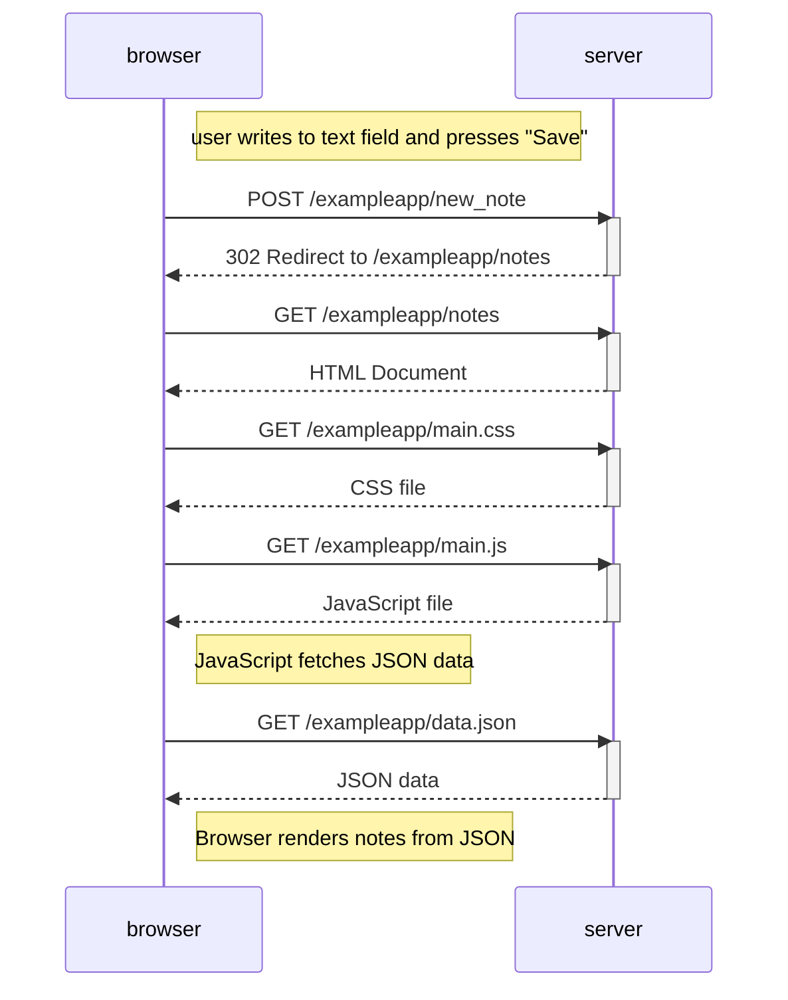

```mermaid

sequenceDiagram
Note right of browser: user writes to text field and presses "Save"

browser->>server: POST /exampleapp/new_note
activate server
server-->>browser: 302 Redirect to /exampleapp/notes
deactivate server

browser->>server: GET /exampleapp/notes
activate server
server-->>browser: HTML Document
deactivate server

browser->>server: GET /exampleapp/main.css
activate server
server-->>browser: CSS file
deactivate server

browser->>server: GET /exampleapp/main.js
activate server
server-->>browser: JavaScript file
deactivate server

Note right of browser: JavaScript fetches JSON data

browser->>server: GET /exampleapp/data.json
activate server
server-->>browser: JSON data
deactivate server

Note right of browser: Browser renders notes from JSON

    
```
    
