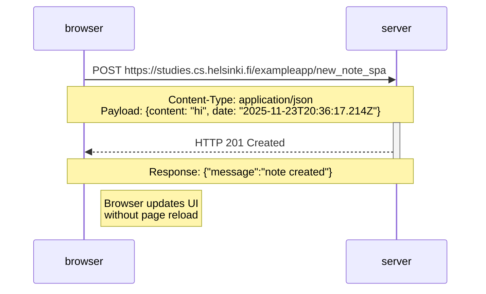

```mermaid
sequenceDiagram
    participant browser
    participant server

    browser->>server: POST https://studies.cs.helsinki.fi/exampleapp/new_note_spa
    Note over browser,server: Content-Type: application/json<br/>Payload: {content: "hi", date: "2025-11-23T20:36:17.214Z"}
    
    activate server
    server-->>browser: HTTP 201 Created
    Note over server,browser: Response: {"message":"note created"}
    deactivate server
    
    Note right of browser: Browser updates UI<br/>without page reload
```
